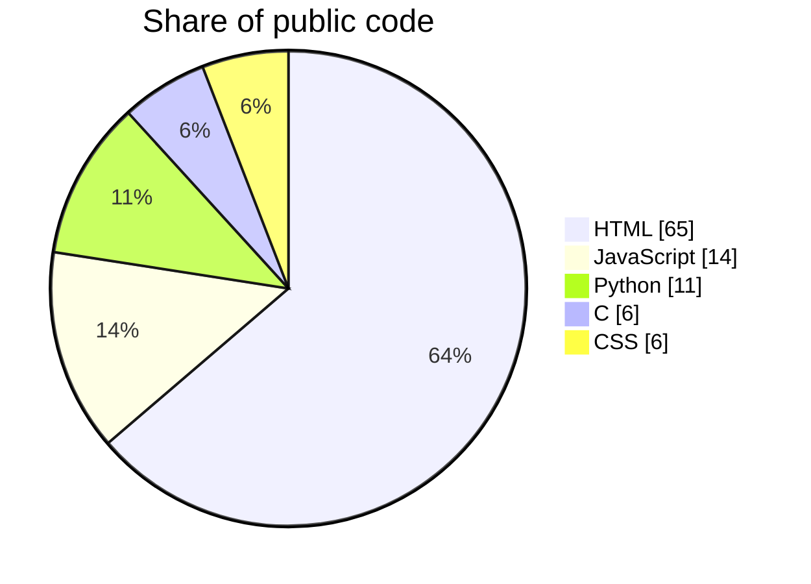
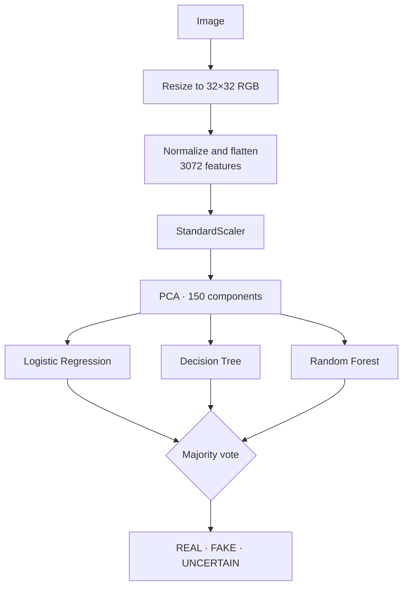
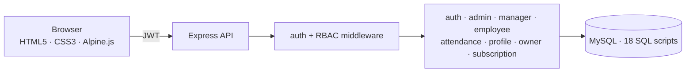
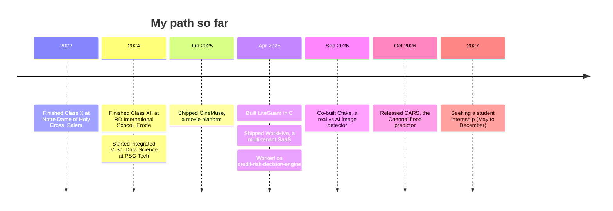

<!-- Profile README for github.com/PaariKarthikeyan -->

<div align="center">


<a href="https://github.com/PaariKarthikeyan">
  
</a>

<br/>


<a href="https://github.com/PaariKarthikeyan?tab=followers"></a>
<a href="https://github.com/PaariKarthikeyan?tab=repositories"></a>


</div>

<br/>

<table width="100%">
<tr>
<td width="68%" valign="middle">

### 👨‍💻 About me

I'm **Paari D K**, an integrated **M.Sc. Data Science** student who likes turning messy real-world data into working products. I build **predictive models**, **system security utilities** and **multi-tenant web apps**, and I share the work in public.

- 🎓 Integrated M.Sc. Data Science at **PSG College of Technology, Coimbatore** (2024 – present)
- 📍 Based in **Kanchipuram, Tamil Nadu, India**
- 🔭 Seeking a **student intern position from May 2027 to December 2027**
- 🧠 Strong in **Decision Trees**, **Data Analytics** and **Front-end Web Development**
- 🌧️ Latest build: a **Chennai flood-risk and road-accessibility predictor**
- 🤝 Open to thoughtful teams, ambitious products and useful engineering work

</td>
<td width="32%" valign="middle" align="center">


**Paari D K**<br/>
<sub>@PaariKarthikeyan</sub>

</td>
</tr>
</table>

---

## 📊 Account at a glance

<table width="100%">
<tr>
<td align="center" width="16%"><h3>7</h3><sub>📦 Public repositories</sub></td>
<td align="center" width="16%"><h3>1</h3><sub>⭐ Stars earned</sub></td>
<td align="center" width="16%"><h3>54</h3><sub>🔥 Contributions</sub></td>
<td align="center" width="16%"><h3>12</h3><sub>📅 Active days</sub></td>
<td align="center" width="16%"><h3>3</h3><sub>👥 Followers</sub></td>
<td align="center" width="16%"><h3>7</h3><sub>➕ Following</sub></td>
</tr>
</table>

<sub>Snapshot taken when this README was written. The live widgets below update on their own.</sub>

<p align="center">
  
  
</p>

<p align="center">
  
</p>

<p align="center">
  
</p>

<p align="center">
  
</p>

<p align="center">
  
</p>

<details>
<summary><b>🧩 GitSkins snapshots (proof metrics, selected work, stack, heatmap)</b></summary>

<p align="center">
  
  
  
  
</p>

</details>

---

## 🧰 Tech toolkit

<p align="center">
  
</p>

<p align="center">
  
  
  
  
  
  
  
  
  
  
  
</p>

**Public code split by language** (from my GitHub profile)



---

## 🚀 Projects

<table width="100%">
<tr>
<th align="left">Project</th><th>Language</th><th>⭐</th><th>🍴</th><th>Commits</th><th>Last push</th><th>Link</th>
</tr>
<tr><td><b>CARS</b> · Chennai flood risk</td><td>Python</td><td align="center">0</td><td align="center">0</td><td align="center">2</td><td>4 Oct 2026</td><td><a href="https://github.com/PaariKarthikeyan/CARS">Repo</a></td></tr>
<tr><td><b>Cfake</b> · Real vs AI image detector</td><td>Python</td><td align="center">0</td><td align="center">2</td><td align="center">10</td><td>7 Sep 2026</td><td><a href="https://github.com/PaariKarthikeyan/Cfake">Repo</a></td></tr>
<tr><td><b>WorkHive</b> · Multi-tenant SaaS</td><td>HTML / JavaScript</td><td align="center">0</td><td align="center">1</td><td align="center">14</td><td>15 Apr 2026</td><td><a href="https://github.com/PaariKarthikeyan/WorkHive-multi-tenant-saas-project-management-platform">Repo</a></td></tr>
<tr><td><b>LiteGuard</b> · Terminal security UI</td><td>C</td><td align="center">1</td><td align="center">1</td><td align="center">17</td><td>4 Apr 2026</td><td><a href="https://github.com/PaariKarthikeyan/LiteGuard">Repo</a></td></tr>
<tr><td><b>credit-risk-decision-engine</b> · fork</td><td>Python</td><td align="center">0</td><td align="center">0</td><td align="center">5</td><td>2 Apr 2026</td><td><a href="https://github.com/PaariKarthikeyan/credit-risk-decision-engine">Repo</a></td></tr>
<tr><td><b>CineMuse</b> · Movie platform</td><td>HTML</td><td align="center">0</td><td align="center">0</td><td align="center">12</td><td>24 Jun 2025</td><td><a href="https://github.com/PaariKarthikeyan/CineMuse-A-Movie-Platform">Repo</a> · <a href="https://paarikarthikeyan.github.io/CineMuse-A-Movie-Platform/">Live</a></td></tr>
<tr><td><b>PaariKarthikeyan</b> · this profile</td><td>Markdown</td><td align="center">0</td><td align="center">0</td><td align="center">1</td><td>4 Oct 2026</td><td><a href="https://github.com/PaariKarthikeyan/PaariKarthikeyan">Repo</a></td></tr>
</table>

<p align="center">
  <a href="https://github.com/PaariKarthikeyan/CARS"></a>
  <a href="https://github.com/PaariKarthikeyan/Cfake"></a>
</p>
<p align="center">
  <a href="https://github.com/PaariKarthikeyan/WorkHive-multi-tenant-saas-project-management-platform"></a>
  <a href="https://github.com/PaariKarthikeyan/LiteGuard"></a>
</p>
<p align="center">
  <a href="https://github.com/PaariKarthikeyan/credit-risk-decision-engine"></a>
  <a href="https://github.com/PaariKarthikeyan/CineMuse-A-Movie-Platform"></a>
</p>

<sub>Click a project below to open its full breakdown.</sub>

<details>
<summary><b>🌧️ CARS · Chennai Flood Risk and Road Accessibility Predictor</b> &nbsp;  </summary>

<br/>

A **geospatial machine-learning system** that predicts flood-prone areas in Chennai and flags roads whose accessibility may drop during heavy rainfall. It scores every grid cell of the city for flood risk, finds recurring flood hotspots and recommends lower-risk routes. Built for research and education, and its routes are not official emergency instructions.

**What it does**

- Predicts Chennai flood risk from geospatial features
- Rainfall-based risk analysis, elevation and slope analysis
- Distance-to-water-body and drainage-density features
- Historical hotspot detection with **DBSCAN**
- Road-network analysis from **OpenStreetMap** using OSMnx
- Risk-adjusted route recommendations (shortest vs lower-risk)
- Model comparison: **Logistic Regression, Random Forest, XGBoost**
- Explainable predictions with **SHAP**
- Interactive **Streamlit** dashboard with **Folium** and **GeoPandas** maps

```mermaid
flowchart LR
    A[Collect datasets] --> B[Validate raw data]
    B --> C[Create Chennai grid]
    C --> D[Process rainfall, elevation,<br/>roads, water, land use, floods]
    D --> E[Extract spatial features]
    E --> F[Create flood labels]
    F --> G[Train models]
    G --> H[Evaluate]
    H --> I[DBSCAN hotspots]
    I --> J[Risk per road segment]
    J --> K[Lower-risk routes]
    K --> L[Streamlit dashboard]
```



| | |
|---|---|
| **Study area** | Chennai, Tamil Nadu · lon 80.05 → 80.35 · lat 12.85 → 13.25 |
| **Coordinate systems** | EPSG:4326 for web maps · EPSG:32644 for distance, area and road length |
| **Rainfall** | NASA POWER daily precipitation (`PRECTOTCORR`, mm/day) |
| **Elevation** | SRTM via Google Earth Engine |
| **Roads, water** | OpenStreetMap via OSMnx |
| **Also uses** | ESA WorldCover, OpenCity, Copernicus Emergency Management, Global Surface Water Explorer |
| **Route cost** | `risk_adjusted_cost = road_length + flood_probability × risk_penalty` |

**Honest limitations:** flood records can be incomplete, a random train-test split can look too optimistic because neighbouring cells are related, and the model does not simulate drainage capacity or live water depth.

**Next steps:** real-time rainfall and water levels, traffic data, flood-depth prediction, spatial cross-validation, alerts, a mobile-friendly UI.

```text
chennai-flood-project/
├── app/streamlit_app.py
├── data/ (raw · processed · final)
├── models/ (logistic_regression · random_forest · xgboost)
├── notebooks/ (01 validation → 05 hotspot analysis)
├── reports/ (metrics · confusion matrix · feature importance)
├── src/ (validate · grid · process_* · combine · train · evaluate · dbscan · route_analysis)
└── requirements.txt
```

```bash
streamlit run app/streamlit_app.py
```

👉 <a href="https://github.com/PaariKarthikeyan/CARS"><b>Open the repository</b></a>

</details>

<details>
<summary><b>🖼️ Cfake · Real vs AI-Generated Image Detector</b> &nbsp;  </summary>

<br/>

A **Flask web app** that decides whether an image is **REAL, FAKE (AI-generated) or UNCERTAIN** using classical machine learning, with drag-and-drop upload, a model performance dashboard and a REST API. Built as a team project.



| Model | Configuration |
|---|---|
| Logistic Regression | `max_iter=1000`, balanced classes |
| Decision Tree | `max_depth=15`, balanced classes |
| Random Forest | 200 trees, `max_depth=20` |

- The best model is chosen by **F1-score** during training
- Dataset: **CIFAKE: Real and AI-Generated Synthetic Images**
- API: `POST /api/predict` (image upload) and `GET /api/results` (evaluation results)
- Stack: Python, Flask, Scikit-learn, NumPy, Pillow, Matplotlib, Seaborn
- Team: Mithunsurya Kumarasamy, **Paari Karthikeyan**, Kavin Balakumar

```bash
pip install -r requirements.txt
python train.py   # trains the models (dataset and models are git-ignored)
python app.py     # then open http://localhost:5000
```

👉 <a href="https://github.com/PaariKarthikeyan/Cfake"><b>Open the repository</b></a>

</details>

<details>
<summary><b>🏢 WorkHive · Multi-tenant SaaS Project Management Platform</b> &nbsp;  </summary>

<br/>

A **multi-tenant SaaS platform** where every organisation gets an isolated workspace, with role-based access control, attendance, leave approvals, project and task management and subscription billing.

**Features**

- 🏢 Multi-tenant architecture with isolated workspaces
- 🔐 Role-based access control for Admin, Manager, Employee and Owner
- ⏱️ Attendance tracking with clock in / clock out
- 🌴 Leave requests with approve and reject
- 📋 Project and task management
- 🔔 Notifications
- 💳 Subscription billing and plan upgrades
- 📈 Activity logs, metrics and monthly reports



| Layer | Technology |
|---|---|
| Runtime | Node.js v14+ |
| Framework | Express |
| Database | MySQL v5.7+ |
| Frontend | HTML5, CSS3, Alpine.js |
| Auth | JWT (`jsonwebtoken`) |
| Passwords | `bcryptjs` |
| Config and CORS | `dotenv`, `cors` |

**Pages:** landing, login, register, dashboard (all roles), profile, attendance.
**Database:** tenants, roles, teams, team members, projects, tasks, task files, project files, notifications, activity logs, leave requests, subscriptions, billing summary, monthly reports, analytics summary, team messages and tenant metrics.

👉 <a href="https://github.com/PaariKarthikeyan/WorkHive-multi-tenant-saas-project-management-platform"><b>Open the repository</b></a>

</details>

<details>
<summary><b>🛡️ LiteGuard · Terminal security UI in C</b> &nbsp; </summary>

<br/>

A lightweight **system security utility with a terminal interface** written in **C** using **ncurses** (`ui.c`). It is my most-iterated project at **17 commits** and the one that earned my first ⭐ and 🍴.

```bash
sudo apt update
sudo apt install libncurses5-dev libncursesw5-dev
gcc ui.c -o liteguard-ui -lncurses
```

👉 <a href="https://github.com/PaariKarthikeyan/LiteGuard"><b>Open the repository</b></a>

</details>

<details>
<summary><b>💳 credit-risk-decision-engine · Credit risk modelling (fork)</b> &nbsp; </summary>

<br/>

A forked **credit-risk decision engine** that I worked on (5 commits). It has a training pipeline, saved models, generated outputs and a Streamlit app.

```text
credit-risk-decision-engine/
├── app.py            # Streamlit app
├── .streamlit/       # app configuration
├── src/
│   ├── pipeline.py   # data and feature pipeline
│   └── train.py      # model training
├── models/           # trained models
├── outputs/          # generated results
└── requirements.txt
```

👉 <a href="https://github.com/PaariKarthikeyan/credit-risk-decision-engine"><b>Open the repository</b></a>

</details>

<details>
<summary><b>🎬 CineMuse · A Movie Platform</b> &nbsp;  </summary>

<br/>

A front-end **movie browsing platform** built with plain HTML, CSS and JavaScript, with separate stylesheets and scripts for desktop, small and mobile screens. It is published with **GitHub Pages**.

```text
CineMuse-A-Movie-Platform/
├── index2.html
├── main.css · small.css · mobile.css
├── main.js  · small.js  · mobile.js · imp.js
└── movies/
```

👉 <a href="https://paarikarthikeyan.github.io/CineMuse-A-Movie-Platform/"><b>Live demo</b></a> · <a href="https://github.com/PaariKarthikeyan/CineMuse-A-Movie-Platform"><b>Repository</b></a>

</details>

---

## 🎓 Education and journey

| | Qualification | Institution | Score |
|---|---|---|---|
| 🎓 | **Integrated M.Sc. Data Science** (2024 – present) | PSG College of Technology, Coimbatore | CGPA **7.17 / 10** |
| 📘 | Higher Secondary, CBSE Class XII (2024) | RD International School, Erode | **85.2%** |
| 📗 | SSLC, CBSE Class X (2022) | Notre Dame of Holy Cross, Salem | **82.4%** |



---

## 🎮 Play with my profile

> GitHub READMEs can't run scripts, so these games use expandable sections. Click a ▶ line to reveal the answer.

### 🧠 Game 1 · How well do you know my projects?

**Q1.** Which of my projects predicts floods?
`A) Cfake` · `B) CARS` · `C) LiteGuard`

<details><summary>👉 Reveal answer</summary><b>B) CARS</b>, the Chennai flood-risk and road-accessibility predictor.</details>

**Q2.** Which language is LiteGuard written in?
`A) Rust` · `B) Go` · `C) C`

<details><summary>👉 Reveal answer</summary><b>C</b>, with an ncurses terminal interface.</details>

**Q3.** Which algorithm finds recurring flood hotspots in CARS?
`A) K-Means` · `B) DBSCAN` · `C) Apriori`

<details><summary>👉 Reveal answer</summary><b>B) DBSCAN</b>, which groups dense clusters of historical flood points.</details>

**Q4.** How many models vote in Cfake's majority decision?
`A) 2` · `B) 3` · `C) 5`

<details><summary>👉 Reveal answer</summary><b>B) 3</b>: Logistic Regression, Decision Tree and Random Forest.</details>

**Q5.** Which project ships 18 SQL scripts and four user roles?
`A) WorkHive` · `B) CineMuse` · `C) credit-risk-decision-engine`

<details><summary>👉 Reveal answer</summary><b>A) WorkHive</b>, with Admin, Manager, Employee and Owner roles.</details>

<details><summary>🏆 Score yourself</summary>

| Score | Title |
|---|---|
| 5 / 5 | 🕵️ **Certified Paari-ologist.** You should probably be recruiting me. |
| 3 – 4 | 🚀 **Sharp explorer.** Go star a repo you liked. |
| 0 – 2 | 🌱 **Fresh visitor.** The project list above is waiting for you. |

</details>

### 🚪 Game 2 · Pick a door

Three doors, three secrets. Choose one.

<details><summary>🚪 &nbsp;<b>Door 1</b></summary>

🌧️ **CARS trick:** instead of picking the shortest road, it adds a penalty for flood probability, so a slightly longer dry road can beat a short flooded one.

</details>
<details><summary>🚪 &nbsp;<b>Door 2</b></summary>

🤖 **Cfake trick:** every image is shrunk to 32×32 pixels (3,072 numbers) and compressed to 150 PCA components before the three models vote. If they disagree, it answers *UNCERTAIN* instead of guessing.

</details>
<details><summary>🚪 &nbsp;<b>Door 3</b></summary>

🏢 **WorkHive trick:** every company gets its own isolated workspace, and a separate owner role manages subscriptions across all of them.

</details>

### 🧮 Game 3 · Route planner puzzle (from CARS)

CARS scores a road with `risk_adjusted_cost = road_length + flood_probability × risk_penalty`, and the **lowest** cost wins. With `risk_penalty = 2000`:

| Route | Length (m) | Flood probability |
|---|---|---|
| 🅰️ Shortcut | 1000 | 0.90 |
| 🅱️ Long way round | 1600 | 0.10 |

Which route does the planner choose?

<details><summary>👉 Reveal answer</summary>

- 🅰️ 1000 + 0.90 × 2000 = **2800**
- 🅱️ 1600 + 0.10 × 2000 = **1800**

**Route B wins.** It is 600 m longer but much less likely to be underwater.

</details>

### ❌⭕ Game 4 · Tic-tac-toe, win in one move

You are **X** and it's your turn. Where do you play to win right now? Number the squares 1–9, left to right, top to bottom.

```text
 X | X | 
---+---+---
 O | O | 
---+---+---
   |   | 
```

<details><summary>👉 Reveal answer</summary>

Play **square 3** (top right) to complete the top row. If you chose 6, O would have won first. 😉

```text
 X | X | X
---+---+---
 O | O | 
---+---+---
   |   | 
```

</details>

### 🔤 Game 5 · Word scramble (tech edition)

Unscramble each word. All of them appear in my projects.

| # | Scramble | Hint |
|---|---|---|
| 1 | `NSDBAC` | Clusters flood hotspots |
| 2 | `ESMLTRAIT` | Python dashboard framework |
| 3 | `XOBGSTO` | Gradient-boosted trees |
| 4 | `ASKLF` | Python web micro-framework |

<details><summary>👉 Reveal answers</summary>

1. **DBSCAN** 2. **STREAMLIT** 3. **XGBOOST** 4. **FLASK**

</details>

### 🎬 Game 6 · Guess the project from emojis

| Emojis | Your guess |
|---|---|
| 🌧️ 🗺️ 🚗 | <details><summary>reveal</summary><b>CARS</b></details> |
| 🖼️ 🤖 🔍 | <details><summary>reveal</summary><b>Cfake</b></details> |
| 🛡️ 💻 🐧 | <details><summary>reveal</summary><b>LiteGuard</b></details> |
| 🏢 👥 📋 | <details><summary>reveal</summary><b>WorkHive</b></details> |
| 🎬 🍿 ✨ | <details><summary>reveal</summary><b>CineMuse</b></details> |
| 💳 📊 ⚖️ | <details><summary>reveal</summary><b>credit-risk-decision-engine</b></details> |

### 🧭 Game 7 · Choose your adventure

Who are you today?

<details><summary>🧑‍💼 &nbsp;<b>A recruiter in a hurry</b></summary>

Read the **Projects** table, then open **WorkHive** (full-stack) and **CARS** (applied ML). I'm available for a **student internship from May to December 2027**.

</details>
<details><summary>👩‍💻 &nbsp;<b>A fellow developer</b></summary>

Start with **LiteGuard** for C and ncurses, then **Cfake** for a clean classical-ML pipeline. Pull requests and issues are welcome.

</details>
<details><summary>🔍 &nbsp;<b>Just curious</b></summary>

Try the **CineMuse live demo**, then come back and play the quiz.

👉 <a href="https://paarikarthikeyan.github.io/CineMuse-A-Movie-Platform/">Open CineMuse</a>

</details>

### 🎲 Game 8 · Refresh roulette

Refresh this page to get a new random developer quote and joke each time. Can you collect five different ones?

<p align="center">
  
</p>
<p align="center">
  
</p>

### 🏓 Game 9 · Challenge me

Think you can beat my quiz scores, or have a puzzle of your own? Open an issue and I'll take a look.

<p align="center">
  <a href="https://github.com/PaariKarthikeyan/PaariKarthikeyan/issues/new?title=Challenge%20accepted%20%F0%9F%8E%AF&body=Hi%20Paari%2C%20here%27s%20my%20quiz%20score%20or%20puzzle%3A%20">
    
  </a>
  <a href="https://github.com/PaariKarthikeyan/PaariKarthikeyan/issues/new?title=Hello%20%F0%9F%91%8B&body=I%20found%20your%20profile%20and%20wanted%20to%20say%20hi%21">
    
  </a>
</p>

---

## 📬 Let's connect

<p align="center">
  <a href="https://github.com/PaariKarthikeyan"></a>
  <a href="https://www.linkedin.com/in/YOUR-HANDLE"></a>
  <a href="https://www.instagram.com/YOUR-HANDLE"></a>
  <a href="mailto:you@example.com"></a>
</p>

<div align="center">

**Open to thoughtful teams, ambitious products and useful engineering work.**


</div>
